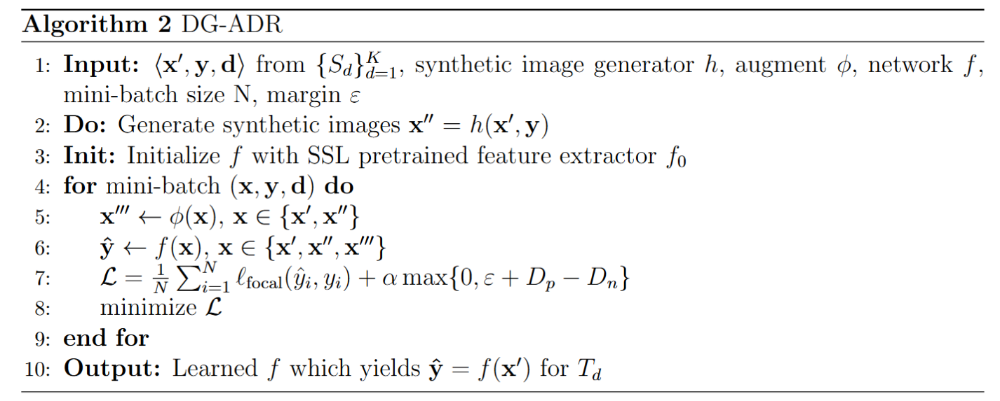

## Domain-Generalized Diabetic Retinopathy Augmentations with Domain Alignment for Cross Domain Generalization

## Abstract 
Diabetic Retinopathy (DR), constituting 5% of global blindness cases, arises from pro-
longed Diabetes Mellitus (DM). Recent findings indicate a significant rise projected to
escalate to an alarming 1.3 billion by 2050. As the DM burden intensifies, so does the
prevalence of DR, necessitating a thorough exploration of efficient grading methodologies.
While numerous deep learning approaches have sought to enhance traditional DR grading
methods, they often falter when confronted with new unseen test data featuring different
distributions to training distributions thus impeding their widespread application.
In this study, we introduce a novel deep learning method for achieving domain general-
ization (DG) in DR classification and make the following contributions. First, we propose
a new way of generating image-to-image diagnostically relevant fundus augmentations con-
ditioned on the grade of the original fundus image. These augmentations are tailored to
emulate the types of shifts in DR datasets. Second, we address the limitations of standard
classification loss in DG for DR fundus datasets by proposing a new DG-specific loss –
alignment loss. Third, we tackle the coupled problem of data imbalance across domains
and categories by proposing to employ Focal loss which seamlessly integrates with our
new alignment loss. Fourth, we address the inevitable issue of observer variability in DR
diagnosis, which consequently induces label noise, hindering the model’s ability to learn
domain-agnostic features that can be generalized to unseen target domains. To mitigate
this challenge, we propose leveraging SSL pretraining, even in scenarios where only a lim-
ited dataset of non-DR fundus images is accessible for pretraining.
Our method demonstrates significant improvements, yielding gains of 5.5%, 3.8%, and
5.8% in accuracy, AUC, and F1-score, respectively, over the strong Empirical Risk Mini-
mization (ERM) baseline. Furthermore, compared to GDRNet, a recently proposed state-
of-the-art DG method for DR, our approach achieves gains of 3.5%, 1.5%, and 3.5% in
accuracy, AUC, and F1-score, respectively. These results underscore the relative superior-
ity of our method in addressing the challenges posed by domain shift in DR diagnosis.

## Method


## Getting Started

### Datasets
For our main OOD generalization evaluation, our study utilized the following datasets:
DeepDR, Messidor-2, IDRID, APTOS, FGADR, RLDR and DDR. The datasets distribution is as follows: 


For finetuning the latent diffusion model only EyePACS is used.
These datasets are collected and processed according to the [GDR-Bench Dataset](https://github.com/chehx/DGDR/tree/main/GDRBench). The dataset sources are also present in the benchmark dataset.

For our SSL pretraining we used:
[ORIGA](https://pubmed.ncbi.nlm.nih.gov/21095735/), [G1020](https://arxiv.org/abs/2006.09158), [ODIR-5K](https://www.kaggle.com/datasets/andrewmvd/ocular-disease-recognition-odir5k?select=ODIR-5K), [Drishti-GS](https://www.kaggle.com/datasets/lokeshsaipureddi/drishtigs-retina-dataset-for-onh-segmentation), [REFUGE](https://www.kaggle.com/datasets/andrewmvd/retinal-disease-classification), [RFMiD](https://www.kaggle.com/datasets/andrewmvd/retinal-disease-classification), [DIARETDB1](https://www.it.lut.fi/project/imageret/diaretdb1/), [DRIONS-DB](https://www.idiap.ch/software/bob/docs/bob/bob.db.drionsdb/master/index.html), [DRIVE](https://www.kaggle.com/datasets/zhz638/drive-dataset), [JSIEC](https://www.kaggle.com/datasets/linchundan/fundusimage1000), [CHASE DB1](https://blogs.kingston.ac.uk/retinal/chasedb1/), [Cataract dataset](https://www.kaggle.com/datasets/jr2ngb/cataractdataset), [Glaucoma detection dataset](https://www.kaggle.com/datasets/sshikamaru/glaucoma-detection), [ROC](https://ieeexplore.ieee.org/abstract/document/5282586) as well as [DR1 and DR2](https://journals.plos.org/plosone/article?id=10.1371/journal.pone.0096814).
The datasets distribution is as follows: 


### Dependencies
For the DG model:
``` 
    pip install -r requirements.txt
```

### Environment used for our experiments
```
Environment
    Python: 3.7.2
    CUDA: 12.2
    OS:  UBUNTU 22.04
```

### How to Run
The presented final main results are averages over three trials employing random seeds (0,1,2). Use the run.sh to run.
```
python main.py \
--root PATH_TO_YOUR_DATASETS \
--algorithm DG_ADR \
--desc dg_adr_seed0 \
--seed 0 \
--val_epochs 5 \
--num_epochs 200 \
--lr 1e-3 \
--batch_size 128 \
--val_batch_size 256 \
--weight_decay 0.0005 \
--optim sgd \
--sd_param 0 \
--project_name dg_adr_seed0  \
--ssl_pretrained \
--checkpoint_path PATH_TO_YOUR_SSL_CHECKPOINT \
--trivial_aug \
--use_syn \
--dropout 0 \
--warm_up_epochs 0 \
--k 5 \
--margin 0.1 \
--loss_alpha 10.0 \
--weight_loss_alpha 1.0 \
```

### References
This repository uses some codes from [DGDR](https://github.com/chehx/DGDR), [SimCLR](https://github.com/sthalles/SimCLR) and [DA-Fusion](https://github.com/brandontrabucco/da-fusion)
