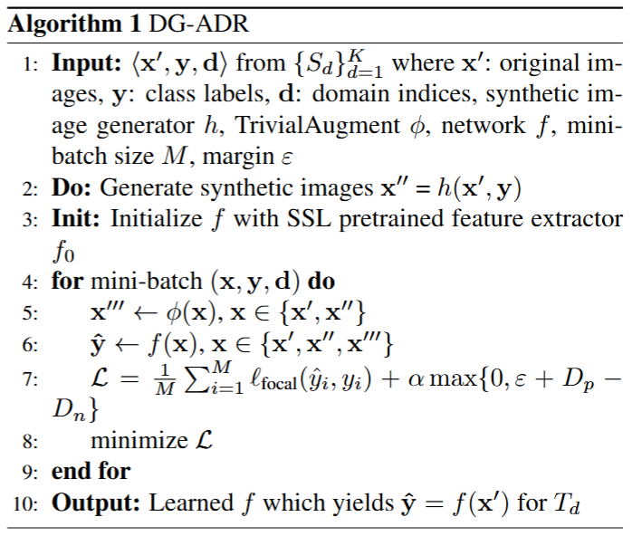
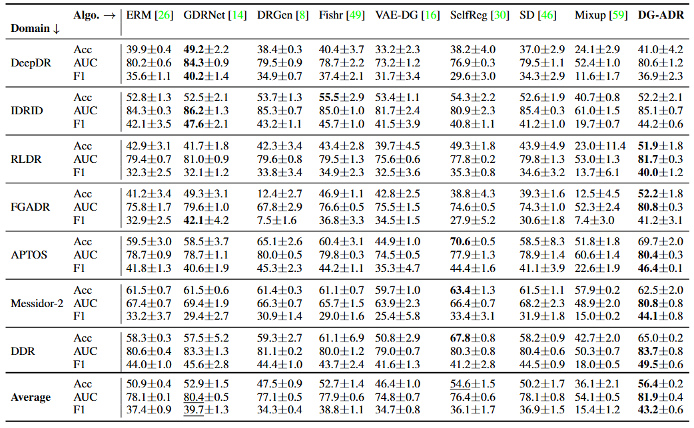

## DG-ADR (WACV 2025)

Official Code implementation of [Divergent Domains, Convergent Grading: Enhancing Generalization in Diabetic Retinopathy Grading ](https://arxiv.org/abs/2411.02614)

Accepted at WACV 2025

Authors: Sharon Chokuwa and Muhammad Haris Khan


## Abstract 
*Diabetic Retinopathy (DR) constitutes 5% of global blindness cases. While numerous deep learning approaches have sought to enhance traditional DR grading methods, they often falter when confronted with new out-of-distribution data thereby impeding their widespread application. In this study, we introduce a novel deep learning method for achieving domain generalization (DG) in DR grading and make the following contributions. First, we propose a new way of generating image-to-image diagnostically relevant fundus augmentations conditioned on the grade of the original fundus image. These augmentations are tailored to emulate the types of shifts in DR datasets thus increase the model's robustness. Second, we address the limitations of the standard classification loss in DG for DR fundus datasets by proposing a new DG-specific loss – domain alignment loss;  which ensures that the feature vectors from all domains corresponding to the same class converge onto the same manifold for better domain generalization. Third, we tackle the coupled problem of data imbalance across DR domains and classes by proposing to employ Focal loss which seamlessly integrates with our new alignment loss. Fourth, due to inevitable observer variability in DR diagnosis that induces label noise, we propose leveraging self-supervised pretraining. This approach ensures that our DG model remains robust against early susceptibility to label noise, even when only a limited dataset of non-DR fundus images is available for pretraining. Our method demonstrates significant improvements over the strong Empirical Risk Minimization baseline and other recently proposed state-of-the-art DG methods for DR grading.*

## Our Method


## Getting Started

### Datasets
1. For our main OOD generalization evaluation, our study utilized the following datasets:
DeepDR, Messidor-2, IDRID, APTOS, FGADR, RLDR and DDR. The table below summarizes the OOD datasets sizes and origins used for our DG model:

| Dataset      | Dataset Size | Dataset Origin               |
|--------------|--------------|-------------------------------|
| DeepDR       | 1600         | Different hospitals in China  |
| Messidor-2   | 1744         | France                        |
| IDRID        | 516          | India                         |
| APTOS        | 3656         | Rural India                   |
| FGADR        | 1842         | UAE                 |
| RLDR         | 1593         | USA                           |
| DDR          | 12497        | 23 provinces in China         |
| EyePACS      | 88698        | USA                           |

*OOD datasets sizes and origins used for our DG model.*

2. For finetuning the latent diffusion model only EyePACS is used.
These datasets are collected and processed according to the [GDR-Bench Dataset](https://github.com/chehx/DGDR/tree/main/GDRBench). The dataset sources are also present in the benchmark dataset.

3. For our SSL pretraining we used:
[ORIGA](https://pubmed.ncbi.nlm.nih.gov/21095735/), [G1020](https://arxiv.org/abs/2006.09158), [ODIR-5K](https://www.kaggle.com/datasets/andrewmvd/ocular-disease-recognition-odir5k?select=ODIR-5K), [Drishti-GS](https://www.kaggle.com/datasets/lokeshsaipureddi/drishtigs-retina-dataset-for-onh-segmentation), [REFUGE](https://www.kaggle.com/datasets/andrewmvd/retinal-disease-classification), [RFMiD](https://www.kaggle.com/datasets/andrewmvd/retinal-disease-classification), [DIARETDB1](https://www.it.lut.fi/project/imageret/diaretdb1/), [DRIONS-DB](https://www.idiap.ch/software/bob/docs/bob/bob.db.drionsdb/master/index.html), [DRIVE](https://www.kaggle.com/datasets/zhz638/drive-dataset), [JSIEC](https://www.kaggle.com/datasets/linchundan/fundusimage1000), [CHASE DB1](https://blogs.kingston.ac.uk/retinal/chasedb1/), [Cataract dataset](https://www.kaggle.com/datasets/jr2ngb/cataractdataset), [Glaucoma detection dataset](https://www.kaggle.com/datasets/sshikamaru/glaucoma-detection), [ROC](https://ieeexplore.ieee.org/abstract/document/5282586) as well as [DR1 and DR2](https://journals.plos.org/plosone/article?id=10.1371/journal.pone.0096814).
The statistics of the datasets used for the SSL pretraining are presented in the table below:

| Dataset                  | Dataset Size |
|-------------------------|--------------|
| ORIGA                   | 650          |
| G1020                   | 1020         |
| ODIR-5K                 | 8000         |
| Drishti-GS              | 101          |
| REFUGE                  | 1200         |
| RFMiD                   | 1200         |
| DIARETDB1               | 89           |
| DRIONS-DB               | 110          |
| DRIVE                   | 40           |
| JSIEC                   | 997          |
| CHASE-DB1               | 28           |
| ROC                     | 100          |
| DR1 and DR2             | 2046         |
| cataract_dataset         | 601          |
| Fundus_Train_Val_Data   | 650          |
| **Total**               | **16832**    |

*Detailed breakdown of the compositions of the retinal datasets utilized during the SSL pretraining phase.*

### Dependencies
For the DG model:
``` 
    pip install -r requirements.txt
```

### Environment used for our experiments
```
Environment
    Python: 3.7.2
    CUDA: 12.2
    OS:  UBUNTU 22.04
```

### How to Run
The presented final main results are averages over three trials employing random seeds (0,1,2). Use the run.sh to run.
```
python main.py \
--root PATH_TO_YOUR_DATASETS \
--algorithm DG_ADR \
--desc dg_adr_seed0 \
--seed 0 \
--val_epochs 5 \
--num_epochs 200 \
--lr 1e-3 \
--batch_size 128 \
--val_batch_size 256 \
--weight_decay 0.0005 \
--optim sgd \
--sd_param 0 \
--project_name dg_adr_seed0  \
--ssl_pretrained \
--checkpoint_path PATH_TO_YOUR_SSL_CHECKPOINT \
--trivial_aug \
--use_syn \
--dropout 0 \
--warm_up_epochs 0 \
--k 5 \
--margin 0.1 \
--loss_alpha 10.0 \
--weight_loss_alpha 1.0 \
```

### Main Results



### Qualitative Results


### Pretrained Models
[SSL pretrained checkpoint](https://drive.google.com/file/d/10Da5KFJwjNUgRyWdOEpVia7zQGv1z9cl/view?usp=sharing)

[Textual Inversion embeddings](https://drive.google.com/drive/folders/1fgBJ07uEWXN2u-UoEy-bqAJZYPKQk-7j?usp=sharing)

[Dreambooth checkpoint]() - Not shared since they are too large, but can be reproduced using the same datasets as mentioned above and the reference code from [DreamBooth training example](https://github.com/huggingface/diffusers/tree/main/examples/dreambooth). We used the follwoing training scripts for this part [finetune_dreambooth_grade_0.sh)](https://github.com/sharonchokuwa/dg-adr/blob/master/fundus_image_generation/finetune_dreambooth/training_scripts/finetune_dreambooth_grade_0.sh), [finetune_dreambooth_grade_1.sh)](https://github.com/sharonchokuwa/dg-adr/blob/master/fundus_image_generation/finetune_dreambooth/training_scripts/finetune_dreambooth_grade_1.sh),[finetune_dreambooth_grade_2.sh)](https://github.com/sharonchokuwa/dg-adr/blob/master/fundus_image_generation/finetune_dreambooth/training_scripts/finetune_dreambooth_grade_2.sh),[finetune_dreambooth_grade_3.sh)](https://github.com/sharonchokuwa/dg-adr/blob/master/fundus_image_generation/finetune_dreambooth/training_scripts/finetune_dreambooth_grade_3.sh),[finetune_dreambooth_grade_4.sh)](https://github.com/sharonchokuwa/dg-adr/blob/master/fundus_image_generation/finetune_dreambooth/training_scripts/finetune_dreambooth_grade_4.sh).

[DG checkpoints](https://drive.google.com/drive/folders/1qeqwqNOMuAGQz8_AB5w7krZStZ4R6XXV?usp=sharing)


### Citation
```
@misc{chokuwa2024divergentdomainsconvergentgrading,
      title={Divergent Domains, Convergent Grading: Enhancing Generalization in Diabetic Retinopathy Grading}, 
      author={Sharon Chokuwa and Muhammad Haris Khan},
      year={2024},
      eprint={2411.02614},
      archivePrefix={arXiv},
      primaryClass={eess.IV},
      url={https://arxiv.org/abs/2411.02614}, 
}
```


### References
This repository uses some codes from [DGDR](https://github.com/chehx/DGDR), [SimCLR](https://github.com/sthalles/SimCLR) and [DA-Fusion](https://github.com/brandontrabucco/da-fusion).
